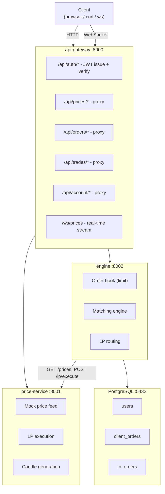
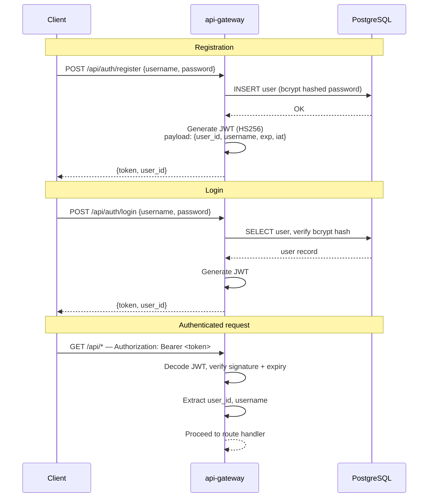
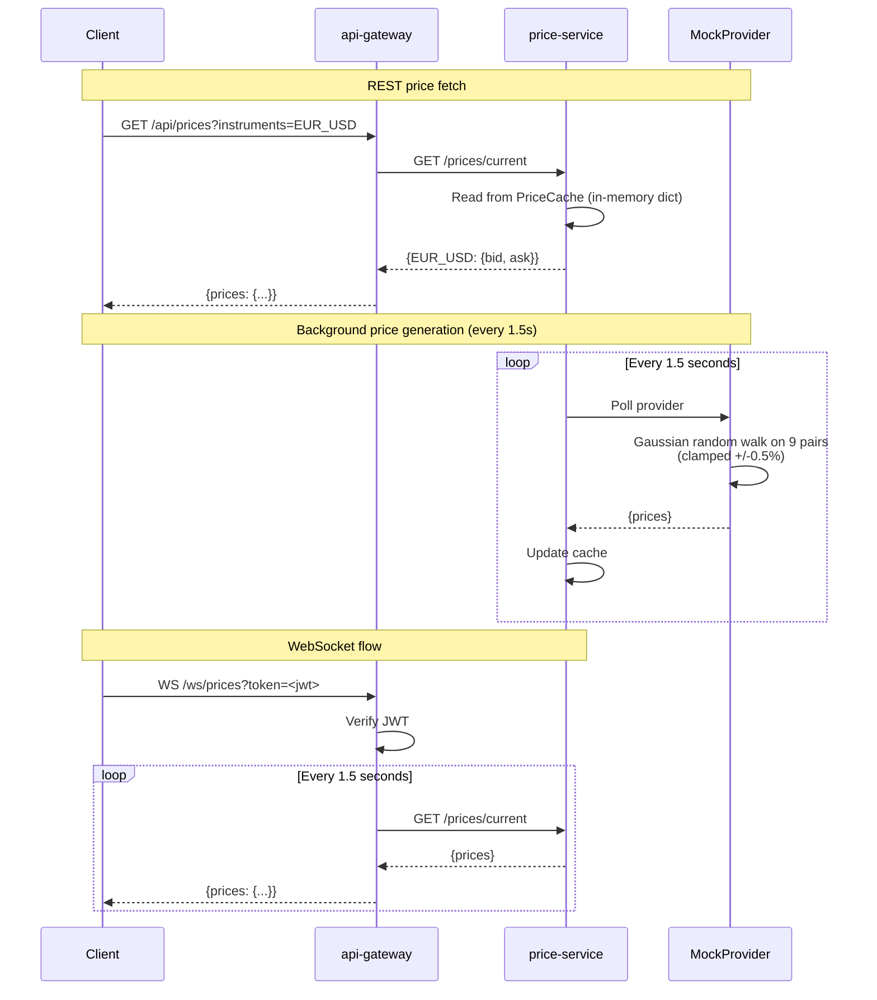
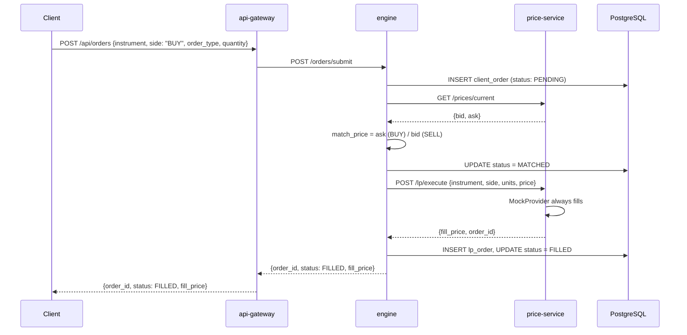
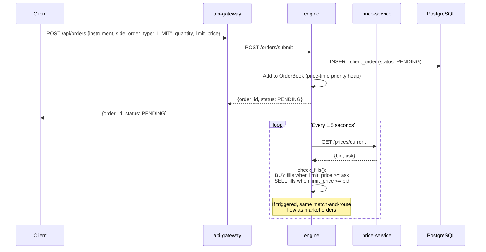
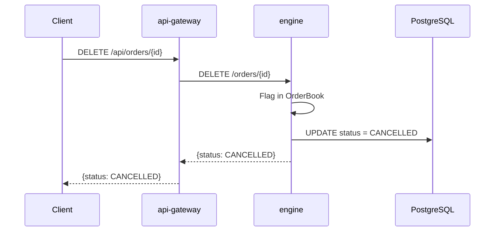

# Nexus FX

A simulated FX trading platform built as an SRE learning sandbox. Three FastAPI microservices handle authentication, market data, and order execution against a synthetic price feed.

## Architecture



## Services

| Service | Port | Description |
|---------|------|-------------|
| **api-gateway** | 8000 | Public entry point. Handles JWT auth, proxies all API calls, serves WebSocket price stream |
| **price-service** | 8001 | Synthetic market data (9 FX pairs), LP order execution, candle generation |
| **engine** | 8002 | Order matching, limit order book, LP routing, trade lifecycle management |
| **postgres** | 5432 | User accounts, order history, LP fill records |

## Supported Instruments

EUR/USD, GBP/USD, USD/JPY, USD/CHF, AUD/USD, NZD/USD, USD/CAD, EUR/GBP, EUR/JPY

## Workflows

### Authentication



All API routes except `/health`, `/api/auth/register`, and `/api/auth/login` require a valid JWT in the `Authorization: Bearer` header. WebSocket connections pass the token as a `?token=` query parameter.

**Default credentials:** `demo` / `demo123` (seeded with $100,000 balance)

### Pricing



The MockProvider generates realistic price movement using a Gaussian random walk seeded from base prices for each pair. Spreads are configured per instrument (e.g., EUR/USD: 1.5 pips, USD/JPY: 1.5 pips). Candle data is fully synthetic, generated on request by walking prices backward from the current value.

### Trading

#### Market Order



#### Limit Order



#### Cancel Order



**Order statuses:** `PENDING` -> `MATCHED` -> `SUBMITTED` -> `FILLED` (or `REJECTED` / `CANCELLED` at any point)

**Order book:** Limit orders are managed in an in-memory order book using Python heaps. BUY side uses a max-heap (highest price, earliest time fills first). SELL side uses a min-heap (lowest price, earliest time fills first). Cancelled orders are lazily removed during fill checks.

## API Reference

### Authentication

| Method | Endpoint | Auth | Description |
|--------|----------|------|-------------|
| POST | `/api/auth/register` | No | Create account. Body: `{username, password, email?}` |
| POST | `/api/auth/login` | No | Login. Body: `{username, password}`. Returns: `{token, user_id}` |
| GET | `/api/auth/me` | JWT | Current user info |

### Market Data

| Method | Endpoint | Auth | Description |
|--------|----------|------|-------------|
| GET | `/api/prices?instruments=EUR_USD,GBP_USD` | JWT | Current bid/ask/mid/spread |
| GET | `/api/prices/candles?instrument=EUR_USD&granularity=H1&count=100` | JWT | OHLCV candle data |
| GET | `/api/prices/instruments` | JWT | List supported instruments |
| WS | `/ws/prices?token=<jwt>` | JWT (query) | Real-time price stream (1.5s interval) |

### Trading

| Method | Endpoint | Auth | Description |
|--------|----------|------|-------------|
| POST | `/api/orders` | JWT | Submit order. Body: `{instrument, side, order_type, quantity, limit_price?}` |
| GET | `/api/orders?status=FILLED` | JWT | List orders (optional status filter) |
| GET | `/api/orders/{id}` | JWT | Get order with LP fill details |
| DELETE | `/api/orders/{id}` | JWT | Cancel pending order |
| GET | `/api/trades/open` | JWT | Open trades (FILLED orders) |
| GET | `/api/trades/closed` | JWT | Closed trades |
| GET | `/api/account/summary` | JWT | Balance and open trade count |

## Database Schema

Three tables in PostgreSQL:

- **`users`** — `id` (UUID), `username`, `password_hash` (bcrypt), `email`, `balance` (default $100,000), `created_at`, `last_login`
- **`client_orders`** — `id` (UUID), `user_id` (FK), `instrument`, `side`, `order_type`, `quantity`, `limit_price`, `status`, `matched_price`, `fill_price`, timestamps
- **`lp_orders`** — `id` (UUID), `client_order_id` (FK), `lp_name` ("simulator"), `lp_order_id`, fill details, `status`, timestamps

Indexed on: `user_id`, `status`, `instrument` (client_orders); `client_order_id`, `status` (lp_orders).

## Getting Started

### 1. Sign up

Create your account at [Blast Radius Lab](https://blastradiuslab.com/signup)

### 2. Clone and install the CLI

```bash
git clone https://github.com/YOUR-USERNAME/nexus-fx.git
cd nexus-fx
pip install -e cli/
```

### 3. Set up your local environment

Complete the [Local Environment Setup](#local-environment-setup) below — all three services must be running and healthy before you start the program.

### 4. Start a session

```bash
br-mentor chat
```

You'll be prompted to log in with the credentials from signup. After that, your AI mentor will guide you through the curriculum — starting with containerization and working through CI, observability, SLOs, deployment, and incident response.

## Local Environment Setup

Get all three services running on your machine before starting `br-mentor chat`. Follow every step — once all three health checks pass, you're ready.

### Prerequisites

- **Python 3.13+**
- **PostgreSQL 16**
- **Git** (you have this if you cloned the repo)

### Step 1 — Python 3.13+

Check your version:

```bash
python3 --version
```

If it's below 3.13, install with [pyenv](https://github.com/pyenv/pyenv) (recommended) or Homebrew:

```bash
# pyenv (recommended)
brew install pyenv
pyenv install 3.13.7
pyenv global 3.13.7

# OR Homebrew
brew install python@3.13
```

### Step 2 — PostgreSQL

```bash
# Install
brew install postgresql@16

# Start the service
brew services start postgresql@16

# Verify
pg_isready
# Should show: /tmp:5432 - accepting connections
```

> **Note:** PostgreSQL needs to be running whenever you work on the project. If you restart your Mac, run `brew services start postgresql@16` again.

### Step 3 — Configure environment

Create the environment file from the template:

```bash
cp .env.example .env
```

Edit `.env` and update these three values for local development:

```
POSTGRES_HOST=localhost
PRICE_SERVICE_URL=http://localhost:8001
ENGINE_SERVICE_URL=http://localhost:8002
```

> **Don't skip this.** The defaults point to Docker container hostnames (`postgres`, `price-service`, `engine`) that won't resolve on your machine.

### Step 4 — Database

Create the database user and database:

```bash
# Create the user (enter 'nexus_dev' when prompted for password)
createuser -P nexus

# Create the database
createdb -O nexus nexus
```

Run the init script to create tables and seed a demo user:

```bash
psql -U nexus -d nexus -f db/init.sql
```

Verify:

```bash
psql -U nexus -d nexus -c "\dt"
# Should show: users, client_orders, lp_orders
```

### Step 5 — Python virtual environment

```bash
# Create and activate
python3 -m venv .venv
source .venv/bin/activate
```

> **Activate every time.** Run `source .venv/bin/activate` at the start of every session. If your prompt doesn't show `(.venv)`, your packages won't be found.

Install dependencies for all three services:

```bash
pip install -r services/price-service/requirements.txt
pip install -r services/engine/requirements.txt
pip install -r services/api-gateway/requirements.txt
```

This may take a minute. Wait for `Successfully installed ...` on each one.

### Step 6 — Start the services

You need **three separate terminal windows**. In each one, activate the venv first (`source .venv/bin/activate`), then start one service.

> **Start in this order.** Engine depends on price-service, and api-gateway depends on both.

**Terminal 1 — price-service:**

```bash
cd services/price-service
python -m uvicorn app.main:app --port 8001
```

**Terminal 2 — engine:**

```bash
cd services/engine
python -m uvicorn app.main:app --port 8002
```

**Terminal 3 — api-gateway:**

```bash
cd services/api-gateway
python -m uvicorn app.main:app --port 8000
```

### Step 7 — Verify

Open a fourth terminal and run:

```bash
curl http://localhost:8001/health
curl http://localhost:8002/health
curl http://localhost:8000/health
```

Each should return `{"status":"ok","service":"..."}`.

Then open http://localhost:8000 in your browser and log in with `demo` / `demo123`. If you see the trading dashboard, you're done.

**All three healthy? Run `br-mentor chat` and start Phase A.**

### Troubleshooting

| Problem | Fix |
|---------|-----|
| `ModuleNotFoundError` | Venv not activated. Run `source .venv/bin/activate` and check `which python` points to `.venv/bin/python` |
| `connection refused` / `could not connect to server` | PostgreSQL isn't running. `brew services start postgresql@16` |
| `database "nexus" does not exist` | Run `createdb -O nexus nexus` then `psql -U nexus -d nexus -f db/init.sql` |
| `role "nexus" does not exist` | Run `createuser -P nexus` (password: `nexus_dev`) |
| `address already in use` | Another process on that port. `lsof -i :8001` then `kill <PID>` |
| Stack trace too long to read | Pipe through tail: `python -m uvicorn app.main:app --port 8001 2>&1 \| tail -20` |